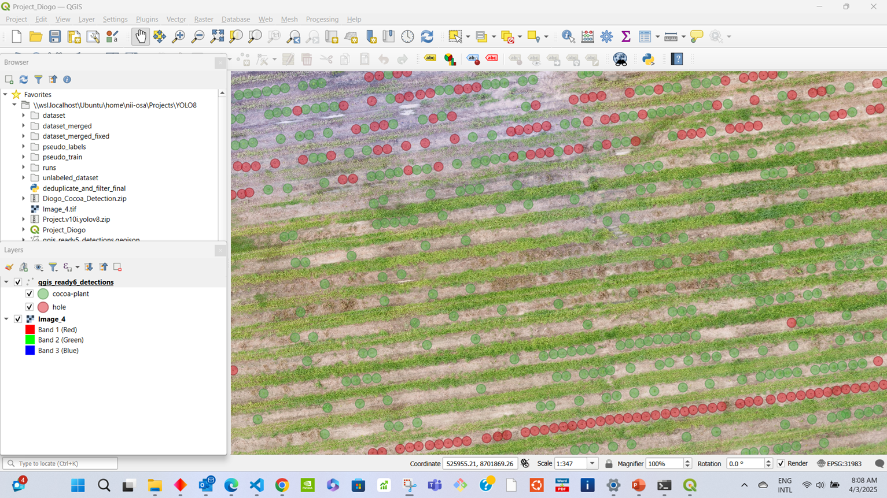
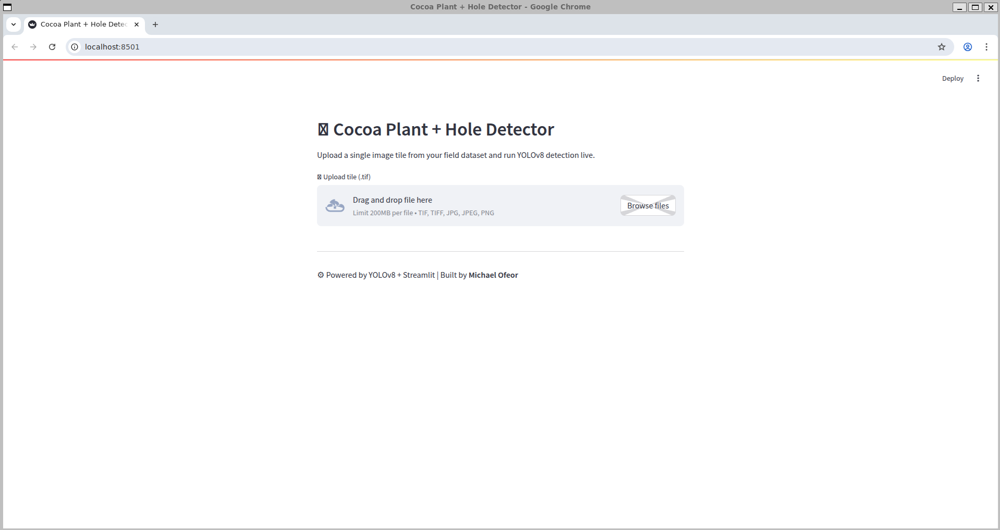
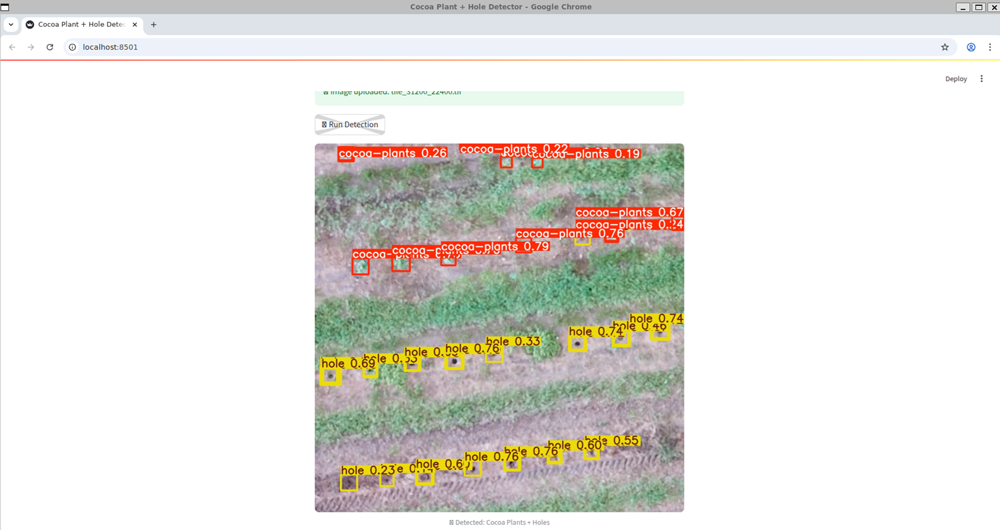
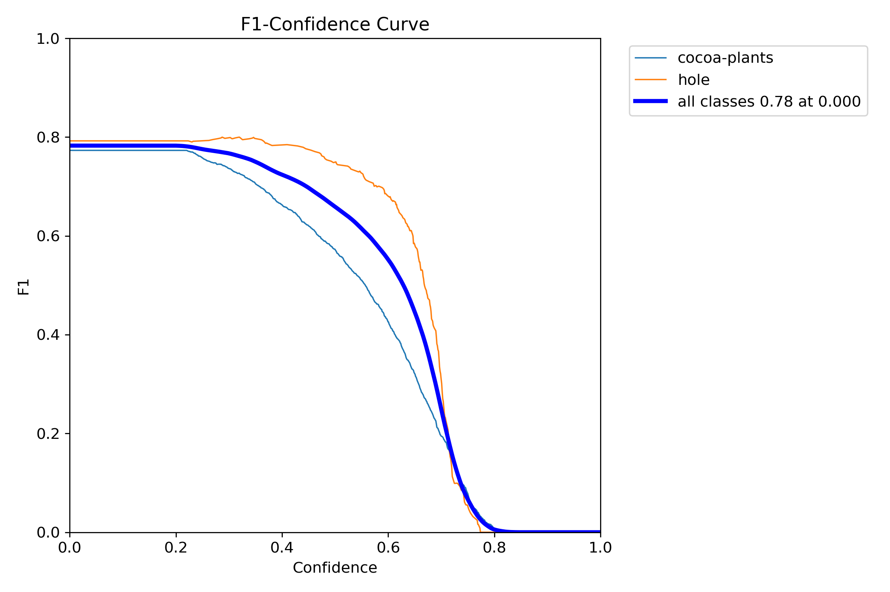
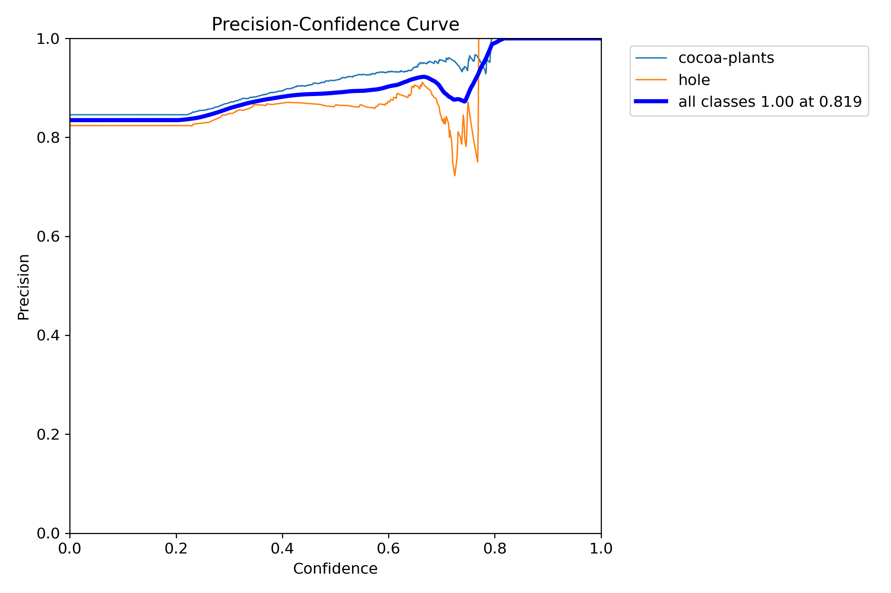
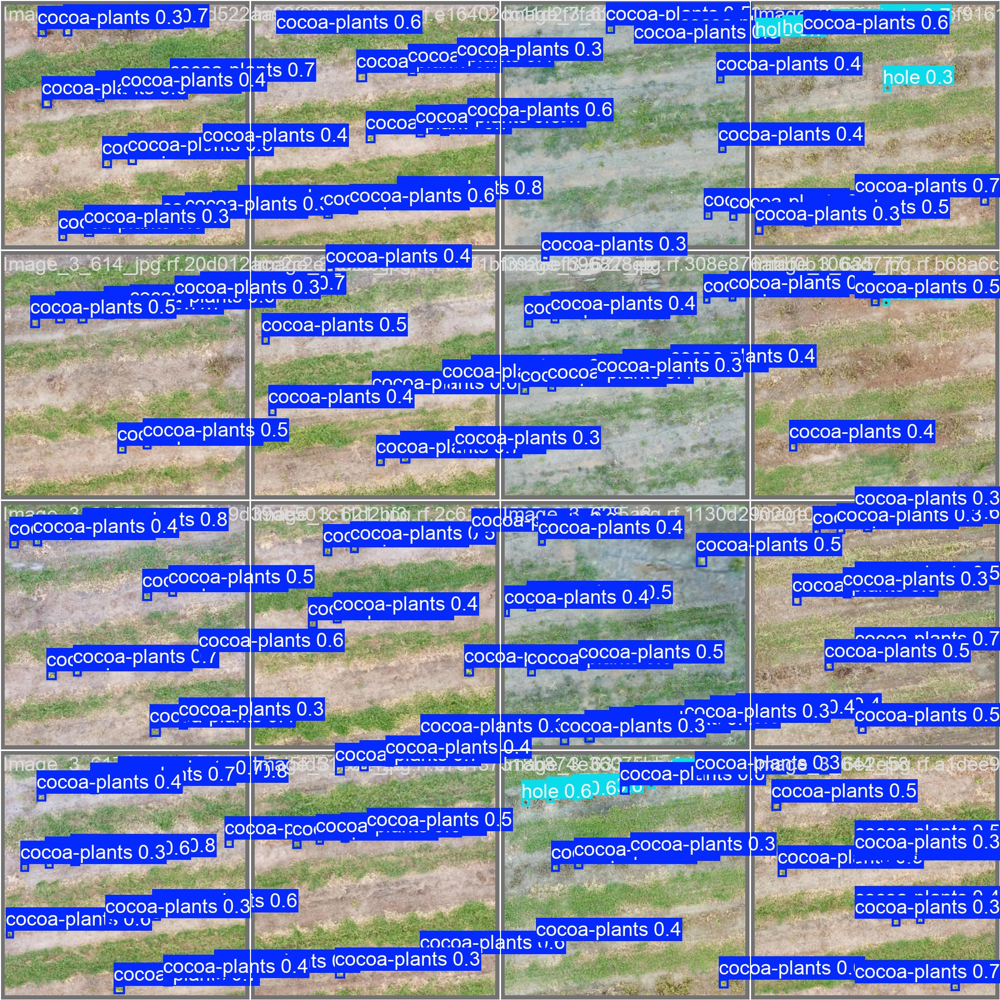
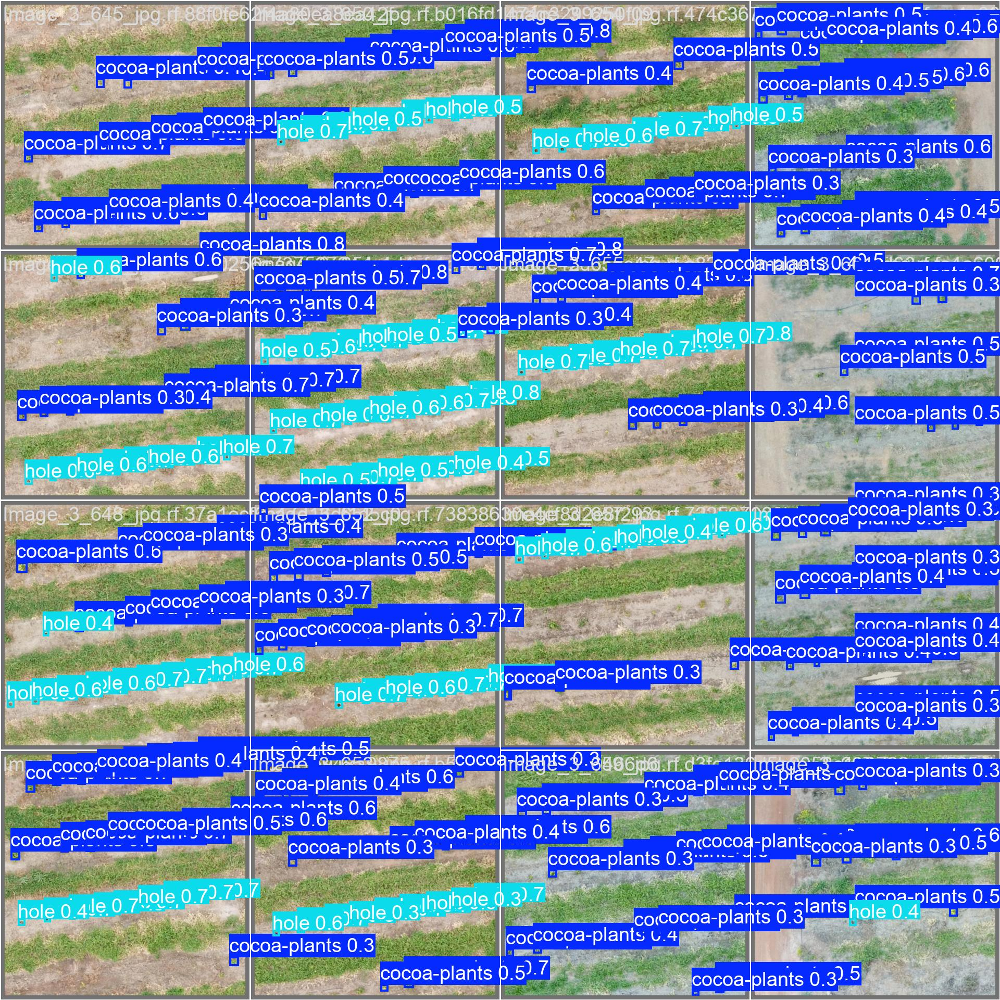

# 🌱 Cocoa Plant Detection + GIS Pipeline with YOLOv8 + Streamlit


---

##  Table of Contents

- [Overview](#overview)
- [Project Structure](#project-structure)
- [Full Detection Pipeline](#full-detection-pipeline)
- [QGIS Integration](#qgis-integration)
- [Streamlit Web Demo](#streamlit-web-demo)
- [Geo-Referencing Details](#geo-referencing-details)
- [Dataset Notes](#dataset-notes)
- [Model Performance](#model-performance)
- [Reproducibility](#reproducibility)
- [Example Visuals](#example-visuals)
- [License](#license)
- [Maintainer](#maintainer)

---

##  Overview

This repository delivers a **production-ready AI pipeline** for detecting **cocoa plants and planting holes** from high-resolution aerial imagery using **YOLOv8** and **QGIS**.

It includes:

- 🧩 Tiling of large orthomosaic images
- 🧠 Batch object detection on tiles
- 🧭 Spatial deduplication and coordinate conversion
- 🗂️ GeoJSON/GPKG export for GIS tools


---

##  Project Structure

```plaintext
cocoa-gis-detection/
├── tile_creator_overlap.py          # Create overlapping tiles from large .tif image
├── yolo_batch_inference_v2.py      # Batch inference with YOLOv8
├── deduplicate_and_filter_final.py # Convert to UTM coordinates, deduplicate, export GeoJSON
├── streamlit_app.py                # Web UI using Streamlit to run YOLOv8 on uploaded tiles
├── examples/                       # Sample outputs (metrics, visualizations, tile)
│   ├── F1_curve.png
│   ├── P_curve.png
│   ├── val_batch0_pred.jpg
│   ├── val_batch1_pred.jpg
│   ├── Final_QGIS_Output.png
│   ├── StreamlitApp.png
│   └── tile_31200_22400.tif
├── README.md                       # Project documentation (this file)
└── LICENSE                         # MIT License
 ```
---

##  Full Detection Pipeline

1. **🧱 Tile Large Aerial Image**
   ```bash
   python tile_creator_overlap.py
   ```

   Input: Image_4.tif

   Output: tiles1/ (1024×1024 px tiles with 22% overlap)

2. 🧠 YOLOv8 Batch Inference
   ```bash
   python yolo_batch_inference_v2.py
   ```

   Inference across all tiles

   Confidence: conf=0.22, IoU: 0.73
0
   Outputs YOLO .txt forma


3. 🌍 Convert to GeoJSON/GPKG

   python deduplicate_and_filter_final.py
 
   Converts to map-based UTM coordinates

   Deduplicates detections from overlapping tiles

   Saves:

   qgis_ready6_detections.geojson

   qgis_ready6_detections.gpkg


## QGIS Integration

   This repo includes a ready-to-open QGIS project:

  📄 Project_Cocoa.qgz
 
   Includes:

   Image_4.tif as the basemap

   Pre-styled detection layer (holes + cocoa plants)

   Correct CRS, colors, symbology


  🚀 To use:
  Open QGIS (v3.28+ recommended)

  Load Project_Cocoa.qgz

  All layers and styles will auto-load 🎯


### 🗺️ GIS Integration Output

**Final Detection Overlay in QGIS**
Bounding boxes converted to UTM, deduplicated, and displayed on the original orthomosaic.




##  Streamlit Web Demo

  A live demo is built with Streamlit for easy testing:

  ```bash 
     streamlit run streamlit_app.py
  ```


Features:

  Upload .tif, .jpg, .png image tile

  Runs YOLOv8 detection in real-time

  Displays annotated predictions

  Fast + local — no data is uploaded


### 🚀 Streamlit Demo

**Live Tile Prediction (via Streamlit)**
This tile was uploaded through the Streamlit UI and predicted live using the trained model.



**Predicted Detection Output**



## Geo-Referencing Details

  These values were extracted from the original orthomosaic (Image_4.tif) and used to convert pixel detections into map-based coordinates (UTM):

  ```
  Origin X      = 525765.6597     ← Upper-left X in UTM meters
  Origin Y      = 8702143.3199    ← Upper-left Y in UTM meters
  Pixel Width   = 0.01298099167   ← ~1.3 cm per pixel
  Pixel Height  = -0.01298099167  ← Negative = North-up
  ```

📌 Important: These values are dataset-specific.
Always extract your raster metadata when working with a different image.


## Dataset Notes

   ```
   Total training images: 1500

   1089 expertly labeled

   411 cleaned pseudo-labeled

   Classes:

   0 = cocoa-plant

   1 = hole
   ```

## Model Performance
 
   ```
| Set        | mAP@0.5 | Precision | Recall | F1 Score |
|------------|---------|-----------|--------|----------|
| Train      | 0.907   | 0.861     | 0.876  | 0.868    |
| Validation | 0.844   | 0.846     | 0.797  | 0.821    |
| Test       | 0.779   | 0.835     | 0.738  | 0.784    |

   ```

✅ Model: YOLOv8s (22.6MB)

⚡ Fast inference: ~16ms per image

🎯 Balanced detection for both classes

🔒 No signs of overfitting despite small dataset


## Reproducibility

Run the pipeline locally:


 1. Tile image
python tile_creator_overlap.py

 2. Run inference
python yolo_batch_inference_v2.py

 3. Convert & deduplicate
python deduplicate_and_filter_final.py

 Optional: Streamlit UI
streamlit run streamlit_app.py


---

## Example Visuals

Here’s a quick walkthrough of the pipeline in action:


### 📊 Training Metrics & Model Behavior

**F1 Score vs Confidence**  


**Precision vs Confidence**  


---

### 🧠 Sample Predictions on Validation Tiles

**Sample Prediction – val_batch0**  


**Sample Prediction – val_batch1**  


---


## License
This repository is licensed under the MIT License.
You’re free to use, modify, and distribute — with credit to the author.


## Maintainer 

Michael Mensah Ofeor
🔗 GitHub – @NiiOsa1
📩 michaelofeor2011@yahoo.com


⚡ Built for real-world cocoa analysis.
Powered by geospatial logic, YOLOv8, and a deep love for clean AI pipelines.


